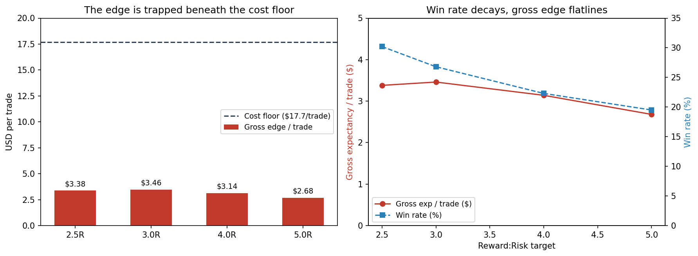

# Fading Intraday Breakouts on Gold — A Falsification Study

A walk-forward, cost-inclusive backtest investigating whether a mechanical breakout/sweep entry has tradeable edge on XAUUSD intraday. **It does not** — and this repo documents *why*, precisely.

The interesting result isn't the strategy (it loses). It's the teardown: locating a faint real edge, attributing the net loss to its true cause, and controlling the confounds that make weak backtests lie.



## The finding in one line

Fading M15 Gold breakouts has a small but real **gross** edge (~$3.40/trade) that is structurally trapped beneath a ~$17.70/trade cost floor. It does not scale with target size and does not survive a timeframe change. A genuine microstructure phenomenon — untradeable with retail-accessible costs.

## What's here

| File | What it is |
|---|---|
| [`RESEARCH_NOTE.md`](RESEARCH_NOTE.md) | The full write-up: hypothesis, method, the falsification chain, results, honest limitations |
| [`src/xauusd_backtest.py`](src/xauusd_backtest.py) | The backtest engine — walk-forward GARCH, momentum, structure entry, FTMO risk accounting |
| `figures/` | Result charts |
| `results/` | Compiled diagnostic tables |

## Method at a glance

- **Walk-forward** rolling GARCH(1,1) — no look-ahead
- **Three isolated layers**: GARCH vol regime, H1 momentum bias, M15 structure entry
- **Costs on every trade**, reconciled to model arithmetic
- **Falsification chain**: exit fix → layer isolation → signal inversion → cost attribution → target-widening → timeframe step-up
- **Confound controls**: trade-count monotonicity, time-stop contamination flagged, price-scaling validated across timeframes

## How to run

```bash
pip install arch pandas numpy matplotlib
python src/xauusd_backtest.py path/to/XAUUSD_M15.csv -i xauusd
```

Get free M15 data from a MetaTrader 5 demo account (History Center → XAUUSD → M15 → export) or HistData.com.

## The honest takeaway

Simple mechanical rules on liquid, retail-saturated intraday instruments are close to efficient at the level such rules can access. If edge exists, it's more likely in execution, regime-conditioning, or less-efficient niches than in a mechanical entry rule. This study rules out the most common beginner trap empirically rather than by assertion.

*This is a falsification study. The negative result is the result.*
